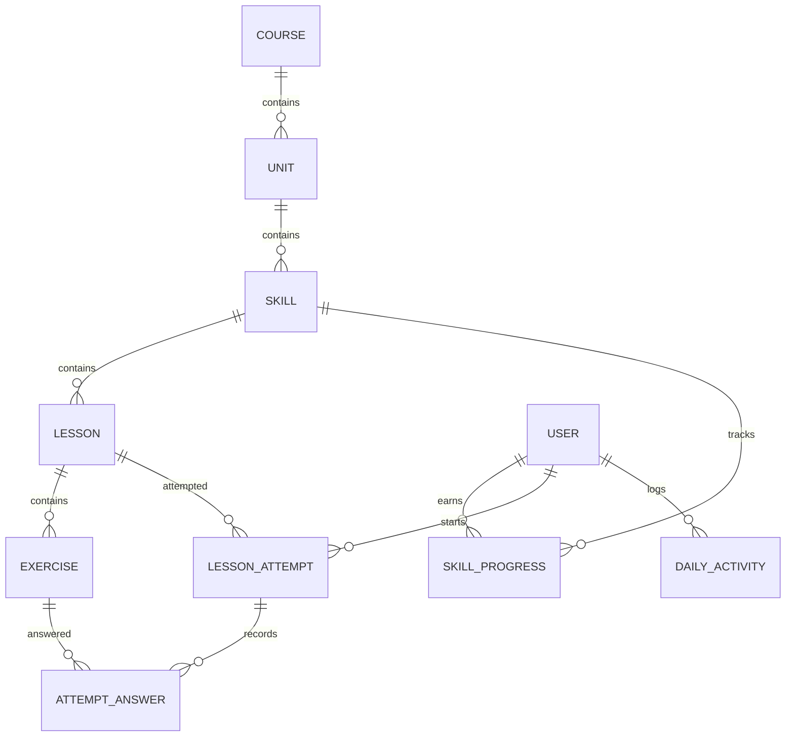

# Duolingo Fullstack Assignment

**Live demo:** [Open the Spanish learning app](https://duolingo-fullstack-clone-seven.vercel.app/)

An original Spanish-learning application built with Next.js/TypeScript, FastAPI, SQLAlchemy, and SQLite. Includes a sequential learning path, five exercise types, persisted lesson attempts, hearts, daily XP goals, streaks, a seeded leaderboard, and learner profiles.

## Run locally on Windows

Requirements: Node.js 22, Python 3.10 or newer, and internet access for installing packages.

From the repository root:

```powershell
python -m venv backend/.venv
.\backend\.venv\Scripts\python.exe -m pip install -r backend\requirements.txt
npm.cmd --prefix frontend install
```

Start the backend in one terminal:

```powershell
Set-Location backend
.\.venv\Scripts\python.exe -m uvicorn app.main:app --reload --host 127.0.0.1 --port 8000
```

Start the frontend in another terminal, from the repository root:

```powershell
npm.cmd --prefix frontend run dev
```

Open http://127.0.0.1:3000. API documentation is at http://127.0.0.1:8000/docs. The database is automatically created and seeded on backend startup. Seeding never resets existing progress.

On macOS/Linux, use `backend/.venv/bin/python` and `npm` instead of the Windows commands above.

## Configuration

Frontend: set `NEXT_PUBLIC_API_URL` in `frontend/.env.local`; defaults to `http://127.0.0.1:8000`.

Backend environment variables:

- `DATABASE_URL`: SQLite URL; defaults to an absolute path at `backend/data/duolingo.db`.
- `CORS_ORIGINS`: comma-separated frontend origins; defaults to the localhost and 127.0.0.1 development origins on port 3000.

The backend reads process environment variables. `.env.example` documents them; it does not automatically load a `.env` file.

## Architecture

The frontend uses App Router pages and reusable dashboard, lesson, and exercise components. Its typed API client presents clear network errors. The backend owns answers, hearts, XP rewards, unlocks, and daily activity. UI selections are local; learner state and submitted exercise answers persist in SQLite. A lesson can be resumed after a refresh.

`backend/app/models.py` defines the schema, `seed.py` defines curated Spanish content, `grading.py` handles pure grading/streak functions, `services.py` builds learner/path/attempt views, and `main.py` defines HTTP routes. SQLite write transactions serialize mutations so repeated or concurrent requests do not award XP or deduct hearts twice.

## Database schema



Content tables preserve ordering with position fields. Exercise public and answer JSON payloads support different exercise types; grading answers are never included in unsubmitted exercise responses. Attempt answers are unique per attempt/exercise. Skill progress is unique per user/skill; activity is unique per user/local date. Foreign keys are enabled. Hearts have a 0–5 database constraint; daily XP is nonnegative.

## API overview

| Method | Route | Purpose |
|---|---|---|
| GET | `/health` | Service health |
| POST | `/api/guests` | Create a guest and return its token |
| GET | `/api/me` | Learner stats and daily goal |
| GET | `/api/courses/{id}/path` | Units, skill progress, lesson availability |
| GET | `/api/me/active-attempt` | Resume an existing lesson |
| POST | `/api/lessons/{id}/attempts` | Start or reuse an active lesson |
| GET | `/api/attempts/{id}` | Current exercise and persisted attempt |
| POST | `/api/attempts/{id}/answers` | Validate and grade the current exercise |
| POST | `/api/attempts/{id}/complete` | Award XP once and update progression |
| POST | `/api/attempts/{id}/abandon` | Exit without lesson rewards |
| POST | `/api/me/hearts/refill` | Mocked free heart refill |
| GET | `/api/leaderboard` | Current weekly seeded ranking |
| GET | `/api/me/profile` | Stats and derived achievements |

Answer requests contain `exercise_id` and an `answer` object: `option_id`, ordered `token_ids`, a `pairs` mapping, or `text` depending on exercise type. 404 indicates a missing resource, 409 a progression/state conflict, and 422 malformed input.

## Learning rules and assumptions

- Each browser gets a separate guest learner through an opaque bearer token stored in localStorage. New guests start with five hearts, zero XP, and lesson 1 available. Clearing browser storage creates a new profile; copying a token grants access to its profile. Existing Alex and seeded leaderboard data are retained.
- One Spanish course with 3 units, 6 skills, 12 lessons, and 60 seeded exercises. The sample learner has already completed the first skill.
- A wrong exercise costs one heart. An entire matching exercise costs at most one heart. At zero hearts the attempt fails; the learner may use a clearly labeled mocked refill and start over.
- Wrong answers reveal the correction and advance; the initial implementation has no end-of-lesson mistake retry queue.
- A successful attempt earns 20 XP, including intentional practice replays. The same attempt can never earn XP twice. A skill completes after both its lessons are completed; progression is linear.
- A daily goal is 40 XP. Streaks count consecutive local dates with completed lessons in Asia/Kolkata. Multiple lessons on the same day do not increase the day count.
- XP totals derive from daily activity. Leaderboards use the current Monday-start week; ties break by user ID. Other learners are seeded profiles.
- Text answers ignore case, repeated whitespace, and trailing punctuation, but retain accents. Accepted variants are curated.
- Gems, account settings, subscriptions, speech recognition, and social features are mocked or placeholders. The owl illustration is original inline SVG.

## Verification

```powershell
Set-Location backend
.\.venv\Scripts\python.exe -m unittest discover -s tests -v
```

```powershell
npm.cmd --prefix frontend run typecheck
npm.cmd --prefix frontend run build
```

Tests cover grading and streak boundaries, idempotent seed/answer/completion requests, lesson locks, refresh recovery, malformed/out-of-order submission, failure/refill, skill unlocking, and abandonment. API tests require installed backend dependencies; the runner marks them skipped when packages are missing.

## Deployment

Frontend: install dependencies and run `npm run build` on a Next.js-compatible host. Set `NEXT_PUBLIC_API_URL` before building.

Backend: install `backend/requirements.txt`, set the working directory to `backend`, and run `python -m uvicorn app.main:app --host 0.0.0.0 --port <host-provided-port>`. Set `CORS_ORIGINS` to the deployed frontend origin. Mount a persistent disk, create its database directory, and set `DATABASE_URL=sqlite:////absolute/mounted/path/duolingo.db`. Verify data survives a restart. Do not store the production database on an ephemeral serverless filesystem.

The public repository and hosted demo links will be added after deployment. See `PROJECT_BLUEPRINT.md` for scope and milestones.

## Current verification status

The frontend TypeScript check and optimized production build pass. Production HTTP smoke checks return 200 for the learning, leaderboard, profile, settings, and lesson routes. All 18 backend tests pass, including API integration tests.

A headless Chrome test against the running frontend and FastAPI backend passes all five exercise types, incorrect feedback/heart deduction, refresh recovery, lesson completion with 20 XP and 80% accuracy, profile/leaderboard rendering, mobile horizontal-overflow checks, and mocked heart refill. Screenshots are saved in the ignored `artifacts/` directory. The browser test completes lesson 3 for the shared demo learner and requires freshly seeded data; use a separate `DATABASE_URL` when repeating it. The script is `backend/tests/browser_smoke.py` and requires Chrome with remote debugging on port 9222.

`backend/requirements.lock.txt` records the exact verified Python environment; use it for reproducible installation. `frontend/package-lock.json` records the frontend versions; use `npm ci` for clean installs. GitHub Actions checks backend tests and the frontend build. A backend Dockerfile is included, but a Docker build and the hosted deployment have not yet been verified.

The live SQLite persistence check also passes: total XP, hearts, streak, completed lesson, and the next unlocked lesson survive stopping and restarting the backend. The browser smoke test has added 20 XP and completed lesson 3 in the local demo database.

For a guided explanation of the implementation, read `CODE_WALKTHROUGH.md`.

## Guest profiles and safe redeployment

`POST /api/guests` returns a cryptographically random token. All learner routes require `Authorization: Bearer <token>`; missing or unknown tokens return 401. SQLite stores the SHA-256 hash in the new `guest_profiles` table, linked to a new user. Attempts belonging to another guest return 404. Leaderboards show the current guest and existing seeded learners, excluding other guest profiles. The frontend uses the same localStorage token across refreshes and tabs (Web Locks serializes initial creation where supported). Storage must be enabled. Tokens remain valid across backend restarts; there is no account recovery or expiry. Serve production traffic over HTTPS.

1. Record the current backend `DATABASE_URL`, persistent disk mount, frontend API URL, and CORS origin. Keep the same database path and disk attached during redeployment. Do not replace the SQLite file with a local database or run a reset/seed cleanup.
2. Back up the deployed database before updating. Use SQLite's online backup API rather than copying an active database file without its WAL. Example on the backend host, substituting the real absolute paths:

   ```python
   import sqlite3
   with sqlite3.connect('/mounted/path/duolingo.db') as source:
       with sqlite3.connect('/mounted/path/duolingo-before-guests.db') as backup:
           source.backup(backup)
   ```

3. Deploy the backend code with the existing environment and persistent disk. Startup adds only `guest_profiles` through `create_all`; it does not alter or drop existing tables. Existing course seeding returns immediately when the course already exists. Old shared progress stays in user 1 and is not assigned to a new visitor.
4. Build and redeploy the frontend with its existing `NEXT_PUBLIC_API_URL`. Backend CORS now permits the Authorization header. Coordinate both releases: the old frontend cannot call the new authenticated learner routes.
5. In two separate browser profiles or a normal and private window, verify distinct learner IDs, complete a lesson in one, and confirm the other retains its own XP, hearts, and unlocks. Refresh the first browser, restart the backend, and verify the same profile and progress return. Check `/health` and keep the backup until these checks pass.

Verification uses isolated test databases, including a file-backed previous-schema database that is reopened after upgrade. Production data is never used by these tests. The older browser smoke script assumes the original seeded learner and lesson 3; it needs adaptation before use with fresh guests.

Guest display names can be changed in Settings. Names are stored locally per guest ID in the browser and shown on Profile and the current learner's leaderboard entry; the backend display name remains unchanged. Clearing site storage removes the custom name. This frontend-only preference requires no API or database migration.

Optional frontend extras include a Listen/Stop control for Spanish sentences and multiple-choice vocabulary using browser speech synthesis, plus a brief lesson-completion confetti animation and daily-goal celebration text. Audio is started only on request, uses an available Spanish voice, and stops when the exercise is left. Unsupported browsers omit the control; voice availability depends on the device. Confetti respects reduced-motion preferences. These features require no backend changes, dependencies, or API keys.

On Learn, the book button beside each unit heading opens a guidebook with curated vocabulary, example phrases, pronunciation controls where supported, and a learning tip. Guides can be read before unlocking lessons and do not award XP or change progress. The dialog supports Escape, keyboard focus containment, and focus return to its book button. Study notes are frontend content matched to the current three seeded units.

Settings ? Appearance includes a dark-mode switch. The preference is saved in browser localStorage and applied before the page paints, including direct lesson links. Light mode is the default. Dark styles cover dashboards, lesson inputs and feedback, guidebooks, and dialogs. No backend changes are required.

Profile displays a badge gallery with earned/locked states, progress bars, and an earned count for the existing Wildfire (3-day current streak), Sage (100 total XP), and Trailblazer (3 completed skills) achievements. Status remains authoritative from `/api/me/profile`; progress is displayed from that response's SQLite-backed learner stats. Wildfire reflects the current streak and can relock after a missed day; this is not a permanent historical award ledger. Badge styles support mobile and dark mode. No API, service, or schema changes are needed.
